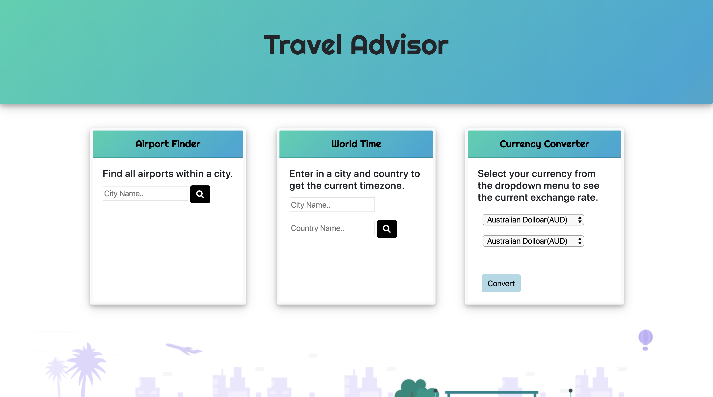

# Travel Advisor

-red)

Developers are often tasked with retrieving data from another API application for their own purposes. 

## [Try it](https://lfernandez79.github.io/travelAdvisor/)

Below are the following API's used to retrieve airports, timezones, and currency exchange rates:

1. [Airport](https://airport-info.p.rapidapi.com/airport?iata=) 

2. [WorldTime](https://rapidapi.com/brianiswu/api/world-time2)

3. [Currency](https://rapidapi.com/natkapral/api/currency-converter5)

## Technology
**HTML, CSS, JQuery, Bootstrap, REST API**

## User Story

As a frequent traveler, I want to be able to keep a dashboard that displayed on my phone or computer that allows me to look at airports located in different cities, the current timezone in a specified coutnry, and the exchange rate of currency between two countries.

## Acceptance Criteria

GIVEN a airport locator
WHEN I search a city
THEN I am presented with current airports for that city
GIVEN a timezone locator
WHEN I search a location with the city and country, 
THEN I am presented with the current FORMATTED time
GIVEN a application to select two currencies and select a value
WHEN I select two currencies to compare
THEN I am presented with the currency exchange rate and new value for the amount that was entered.

The following image shows a preview of the template:

