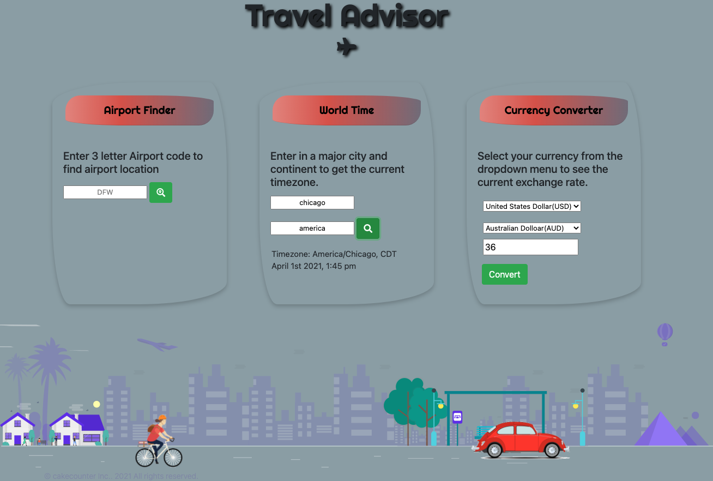

# Travel Advisor
Travel Advisor is a web app that allows frequent travelers to keep a dashboard of important information, including airport locations, timezones, and currency exchange rates. The app is designed to be easy to use and accessible on both phones and computers.

## User Story
As a frequent traveler, I often need to know important information about the places I'm visiting. Travel Advisor allows me to keep a dashboard of this information, including airport locations, timezones, and currency exchange rates. With this information at my fingertips, I can travel with confidence and make the most of my trips.

## [Try it](https://traveladvisor.netlify.app/)

## Technology
The following technologies are used in Travel Advisor:
- HTML
- CSS
- JQuery 
- Bootstrap
- REST API
- MomentJS

Here are some screenshots of Travel Advisor in action:

## API 
Travel Advisor uses the following APIs to retrieve airport information, timezones, and currency exchange rates:

1. [Airport info](https://rapidapi.com/Active-api/api/airport-info/) This API provides information about airports around the world, including their location and other important details.

2. [WorldTime](https://rapidapi.com/brianiswu/api/world-time2) This API provides information about timezones around the world, including the current time in a specified country.

3. [Currency](https://rapidapi.com/natkapral/api/currency-converter5) This API provides information about currency exchange rates between two countries.

## Future

> Implement MapQuest API to provide more accurate location data for airports and cities.

> Migrate from jQuery to vanilla JavaScript to improve the app's performance and maintainability.

> Develop a Progressive Web App (PWA) version of Travel Advisor to allow users to access the app offline and enjoy a faster, more immersive experience.
