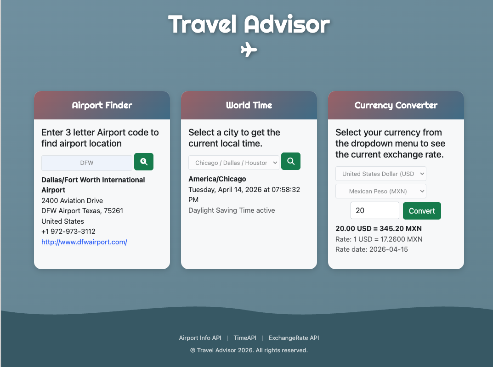

# Travel Advisor
Travel Advisor is a web app that allows frequent travelers to keep a dashboard of important information, including airport locations, timezones, and currency exchange rates. The app is designed to be easy to use and accessible on both phones and computers.

[](https://app.netlify.com/sites/traveladvisor/deploys)


## User Story
As a frequent traveler, I often need to know important information about the places I'm visiting. Travel Advisor allows me to keep a dashboard of this information, including airport locations, timezones, and currency exchange rates. With this information at my fingertips, I can travel with confidence and make the most of my trips.

## [Try it](https://traveladvisor.netlify.app/)

## Technology
The following technologies are used in Travel Advisor:
- HTML
- CSS
- Vanilla JavaScript (ES Modules)
- Bootstrap 5
- Vite (build tool)
- REST APIs

Here are some screenshots of Travel Advisor in action:



## Getting Started

```bash
npm install
npm run dev      # start local dev server at http://localhost:5173
npm run build    # build for production
```

Copy `.env.example` to `.env` and add your RapidAPI key for the Airport Finder widget:

```
VITE_AIRPORT_API_KEY=your_rapidapi_key_here
```

## APIs
Travel Advisor uses the following APIs to retrieve airport information, timezones, and currency exchange rates:

1. [Airport Info](https://rapidapi.com/Active-api/api/airport-info/) — Provides airport details by IATA code (e.g. DFW, JFK). Requires a RapidAPI key stored in `.env`.

2. [TimeAPI](https://timeapi.io/) — Provides the current local time for any timezone. Free, no API key required. Select from a dropdown of major world cities grouped by region.

3. [ExchangeRate API](https://www.exchangerate-api.com/) — Provides live currency exchange rates. Free, no API key required.

## Accomplished

> ~~Migrate from jQuery to vanilla JavaScript~~ — Completed. Migrated to vanilla JS ES modules with the Fetch API, replaced MomentJS with native `Intl.DateTimeFormat`, and upgraded Bootstrap 4 to Bootstrap 5.

> ~~UI modernization~~ — Completed. Refreshed design with a cohesive color palette (coral-to-steel-blue card headers, ocean-tone body gradient), responsive card layout, improved input styling, and a clean SVG wave footer with API credits.

## Future

> Implement MapQuest API to provide more accurate location data for airports and cities.

> Develop a Progressive Web App (PWA) version of Travel Advisor to allow users to access the app offline and enjoy a faster, more immersive experience.
